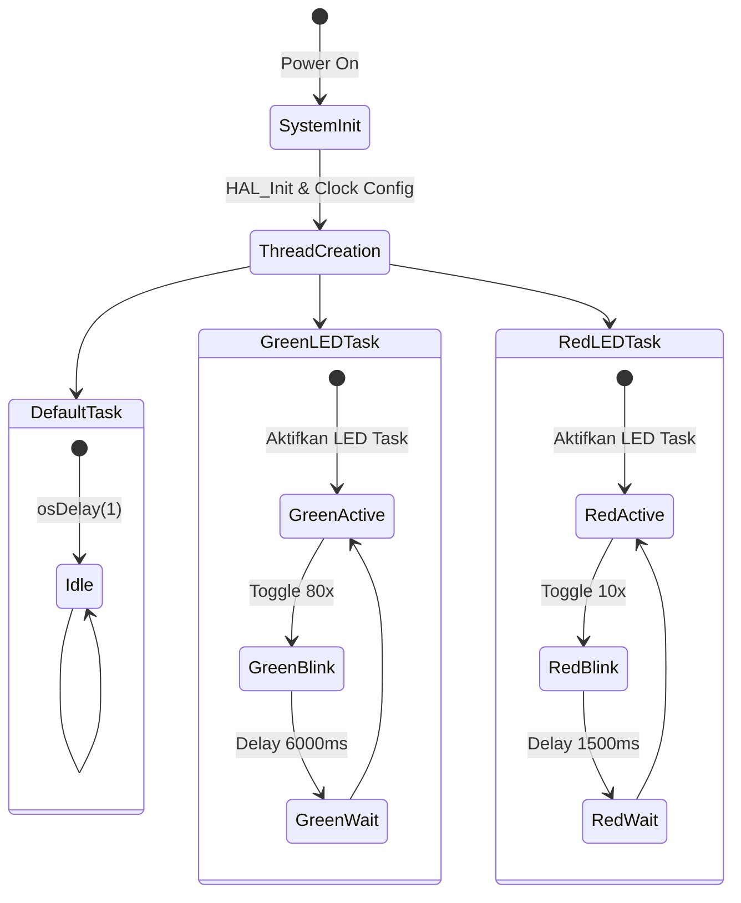

# Sistem Kontrol LED Multi-Thread dengan FreeRTOS

## Tentang Proyek
Proyek ini adalah implementasi sistem kontrol LED menggunakan STM32 microcontroller dengan FreeRTOS sebagai sistem operasi real-time. Sistem ini mengelola dua LED (hijau dan merah) dengan pola kedipan yang berbeda menggunakan tiga thread terpisah.

## Diagram Alur Kerja

## Struktur Task

### 1. Default Task
- Prioritas: Normal (osPriorityNormal)
- Stack Size: 128 bytes
- Fungsi: Task ini berjalan dalam loop kosong dengan delay minimal, berfungsi sebagai task idle system.

### 2. Green LED Task (GreenLEDTask)
- Prioritas: Normal (osPriorityNormal)
- Stack Size: 128 bytes
- Fungsi:
  - Mengontrol LED hijau dengan pola kedipan spesifik
  - Menyalakan indikator task LED hijau
  - Mengedipkan LED hijau 80 kali dengan interval 25ms
  - Memberikan jeda 6000ms sebelum siklus berikutnya
  - Total waktu siklus: sekitar 10 detik

### 3. Red LED Task (RedLEDTask)
- Prioritas: Di atas Normal (osPriorityAboveNormal)
- Stack Size: 128 bytes
- Fungsi:
  - Mengontrol LED merah dengan pola kedipan yang lebih cepat
  - Menyalakan indikator task LED merah
  - Mengedipkan LED merah 10 kali dengan interval 25ms
  - Memberikan jeda 1500ms sebelum siklus berikutnya
  - Total waktu siklus: sekitar 2 detik

## Interaksi Antar Task
- Ketiga task berjalan secara independen tanpa saling mempengaruhi
- RedLEDTask memiliki prioritas lebih tinggi dibandingkan task lainnya
- Setiap task memiliki LED indikator terpisah untuk menunjukkan status aktif
- DefaultTask berjalan di background sebagai idle task

## Konfigurasi Hardware
- Menggunakan GPIO Port A untuk semua LED
- Konfigurasi pin sebagai output push-pull
- Tidak menggunakan pull-up/pull-down resistor
- Kecepatan clock diatur ke frekuensi rendah untuk efisiensi daya

## Persyaratan Sistem
- STM32 Microcontroller
- FreeRTOS
- STM32CubeIDE atau environment pengembangan serupa
- HAL Driver STM32

## Cara Penggunaan
1. Clone repository ini
2. Buka proyek menggunakan STM32CubeIDE
3. Build proyek
4. Flash ke board STM32
5. LED akan mulai berkedip sesuai pola yang telah diprogram

## Catatan Pengembangan
- Program menggunakan HSI (High Speed Internal) clock
- Tidak menggunakan PLL untuk simplisitas
- Menggunakan HAL library untuk abstraksi hardware

https://github.com/user-attachments/assets/bf57447d-98f3-44c9-9bbd-ed13157075ad

